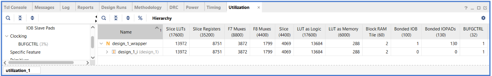

# Technical Report: Hardware AES-256 CTR Encryption/Decryption Module with Ethernet

**Course / Internship Program:** Short-Term Training Program (STTP) on ASIC & FPGA SoC Design  
**Department:** Department of Electronics, Cochin University of Science & Technology (CUSAT)  
**Authors:** Adithyan B & Karun  
**Target Device:** AMD/Xilinx Zynq-7000 SoC (`xc7z010clg400-1` / `xc7z020clg400-1`)  
**Development Toolchain:** AMD/Xilinx Vivado Design Suite & Vitis Unified IDE (v2025.2)  

---

## 1. Introduction & Project Scope

Modern secure communications require high-throughput cryptographic processing. Traditional software implementations executing on general-purpose CPUs often become processing bottlenecks due to serial byte-level manipulations, memory access latency, and context switching. This project implements a **Hardware AES-256 CTR (Counter) mode Encryption/Decryption Module with Ethernet** using a hardware-software co-design paradigm on a Xilinx Zynq-7000 All Programmable System-on-Chip (SoC).

The architecture partitions the workload logically:
1. **Processing System (PS - ARM Cortex-A9):** Executes a bare-metal C application that initializes the LwIP network stack, opens a TCP listener to receive plaintext/ciphertext files from a PC over RJ45 Ethernet, manages DMA transactions, and profiles execution time.
2. **Programmable Logic (PL - FPGA Fabric):** Implements a high-frequency, fully pipelined 14-stage AES-256 core configured for Counter (CTR) mode. It processes data at a throughput of one 128-bit block per clock cycle.

By implementing Counter (CTR) mode in hardware, we enable **symmetric encryption and decryption** using a single encryption pipeline, saving approximately 50% of the FPGA fabric area while avoiding the pipeline stalls inherent in feedback-driven modes like Cipher Block Chaining (CBC).

---

## 2. Cryptographic Theory & Mathematical Formulation

### 2.1 AES-256 Algorithm Overview
AES-256 operates on a fixed 128-bit block size ($N_b = 4$ words) with a 256-bit key ($N_k = 8$ words) across $N_r = 14$ rounds. The state is represented as a $4 \times 4$ byte matrix. Each round (except the final round) comprises four algebraic transformations over the Galois Field $\text{GF}(2^8)$ defined by the irreducible polynomial:
\[ P(x) = x^8 + x^4 + x^3 + x + 1 \]

1. **SubBytes:** A non-linear byte substitution where each byte $s_{r,c}$ is replaced by its multiplicative inverse in $\text{GF}(2^8)$ followed by an affine transformation:
   \[ s'_{r,c} = \text{S-Box}(s_{r,c}) \]
2. **ShiftRows:** A cyclical shift where Row $r$ is shifted left by $r$ bytes:
   \[ s'_{r,c} = s_{r, (c + r) \bmod 4} \]
3. **MixColumns:** A column-wise multiplication modulo $x^4+1$ with a fixed polynomial:
   \[ a(x) = \{03\}x^3 + \{01\}x^2 + \{01\}x + \{02\} \]
   In matrix representation:
   \[
   \begin{bmatrix}
   s'_{0,c} \\ s'_{1,c} \\ s'_{2,c} \\ s'_{3,c}
   \end{bmatrix}
   =
   \begin{bmatrix}
   02 & 03 & 01 & 01 \\
   01 & 02 & 03 & 01 \\
   01 & 01 & 02 & 03 \\
   03 & 01 & 01 & 02
   \end{bmatrix}
   \begin{bmatrix}
   s_{0,c} \\ s_{1,c} \\ s_{2,c} \\ s_{3,c}
   \end{bmatrix}
   \]
   Multiplication by $\{02\}$ is performed in hardware using the `xtime` function:
   \[
   \text{xtime}(b) = (b \ll 1) \oplus ( (b \land 0x80) ? 0x1b : 0x00 )
   \]
4. **AddRoundKey:** The state is XORed with a 128-bit round key derived from the key schedule:
   \[ s'_{r,c} = s_{r,c} \oplus w_{4 \cdot \text{round} + c} \]

### 2.2 Counter (CTR) Mode of Operation
CTR mode transforms a block cipher into a stream cipher. An incrementing 128-bit counter block ($\text{Ctr}_i$) is encrypted by the AES-256 engine to produce a key stream block ($\text{KS}_i$). The ciphertext ($\text{C}_i$) is generated by XORing the plaintext ($\text{P}_i$) with the keystream:
\[ \text{Ctr}_0 = \text{IV} \]
\[ \text{Ctr}_i = \text{Ctr}_{i-1} + 1 \]
\[ \text{KS}_i = \text{AES\_Encrypt}_{\text{Key}}(\text{Ctr}_i) \]
\[ \text{C}_i = \text{P}_i \oplus \text{KS}_i \]

Decryption uses the **exact same encryption pipeline**, applying the identical key stream block to the ciphertext to recover the plaintext:
\[ \text{P}_i = \text{C}_i \oplus \text{KS}_i \]

```
Encryption:
Plaintext Block (P_i) ------> [ XOR ] -------> Ciphertext Block (C_i)
                                 ^
                                 |
                          Keystream Block (KS_i)
                                 ^
                                 |
Counter (Ctr_i) ---------> [ AES-256 Enc ]

Decryption:
Ciphertext Block (C_i) ------> [ XOR ] -------> Plaintext Block (P_i)
                                 ^
                                 |
                          Keystream Block (KS_i)
                                 ^
                                 |
Counter (Ctr_i) ---------> [ AES-256 Enc ]
```

---

## 3. Hardware Architecture & RTL Design (PL)

The custom IP core (`aes256_ctr_top`) is designed in synthesizable Verilog-2001. It contains three main blocks: the register bank (AXI4-Lite), the streaming bus wrapper (AXI4-Stream), and the pipelined encryption core.


```
+--------------------------------------------------------------------------------+
| aes256_ctr_top IP Core                                                         |
|                                                                                |
|  +--------------------+                                                        |
|  | AXI4-Lite Slave    |                                                        |
|  |  - Key (Reg 0-7)   |                                                        |
|  |  - IV  (Reg 8-11)  |----+                                                   |
|  |  - Ctrl(Reg 12)    |    | (256-bit Key, 128-bit IV)                         |
|  +--------------------+    v                                                   |
|                      +-----+-----------------------------------------+         |
|                      | aes256_ctr_core                               |         |
|                      |                                               |         |
|                      |        +-------------------------------+      |         |
|  +----------------+  |  +---->| 14-Stage AES-256 Pipeline     |      |         |
|  | AXI4-Stream    |  |  |     |  - Latency: 15 clock cycles   |---+  |         |
|  | Slave Interface|==|=>|     +-------------------------------+   |  |         |
|  |  (32-bit beat) |  |  |                                       v  |         |
|  +----------------+  |  | (128-bit Counter)                  [XOR] |         |
|                      |  |                                       ^  |         |
|                      |  |     +-------------------------------+ |  |         |
|                      |  +---->| 15-Stage Data Delay Line      |-+  |         |
|  +----------------+  |        +-------------------------------+    |         |
|  | AXI4-Stream    |  |                                             |         |
|  | Master Interf. |<=|=============================================+         |
|  |  (32-bit beat) |  |                                                       |
|  +----------------+  +-------------------------------------------------------+
+--------------------------------------------------------------------------------+
```

### 3.1 14-Stage Pipelined Datapath (`aes256_encrypt_pipeline.v`)
To support a high-speed data stream, each of the 14 rounds is registered. 
- **Stage 0:** Input registers for the 128-bit state.
- **Stage 1 to 13:** Fully registered round modules (`aes_round_enc`). Each round performs SubBytes (via 16 S-Boxes), ShiftRows, MixColumns (xtime logic), and AddRoundKey.
- **Stage 14:** Final round (MixColumns bypassed) followed by output registers.
The pipeline accepts a new 128-bit input on every clock cycle. The pipeline latency is exactly 15 clock cycles.

### 3.2 Address Space Mapping & Vivado Editor
The custom AES IP register space is mapped in the Zynq GP0 AXI Master address space:


### 3.3 Physical Placement & Reports
The synthesized and placed design is mapped onto the physical layout of the Zynq FPGA die:


#### Resource Utilization Summary:


#### Timing Closure Summary:


#### On-Chip Power Summary:


### 3.4 Counter Core & Alignment Delay Line (`aes256_ctr_core.v`)
Because the AES pipeline has a latency of 15 clock cycles, the counter value ($\text{Ctr}_k$) fed at Cycle $T_0$ emerges as keystream ($\text{KS}_k$) at Cycle $T_{15}$. To align the plaintext/ciphertext block ($\text{P}_k$) with its corresponding keystream block, the core implements a **15-stage parallel shift register delay line** for the data bus.
- When `in_valid` is asserted, a counter is loaded into the pipeline, and the input data is loaded into `data_delay[0]`.
- As the counter propagates down the AES pipeline, the data block shifts down the `data_delay` array.
- On Cycle 15, the data emerges from `data_delay[14]` and is XORed with the pipeline output `aes_out`, yielding the valid ciphertext/plaintext.
- The packet boundary indicator `TLAST` is shifted through a matching 15-stage `last_pipe` delay line, ensuring packet boundaries remain aligned.

### 3.3 AXI4-Stream Serialization / Deserialization (`aes256_ctr_axi_stream.v`)
Zynq AXI DMAs typically operate on a 32-bit bus. The wrapper acts as a serializer/deserializer:
- **Slave Port:** Accumulates four 32-bit beats into a 128-bit block, then asserts `core_in_valid` once complete.
- **Master Port:** Accepts a 128-bit output block from the core and splits it into four 32-bit beats written back to the DMA.
- **Backpressure Support:** If the downstream DMA is not ready (`M_AXIS_TREADY == 0`), the wrapper deasserts `core_out_ready`, which propagates to deassert the pipeline enable (`en`), freezing all 15 stages of the AES pipeline and the data delay line to prevent data loss.

### 3.4 Hardware Security & Key Zeroization
REG 12 of the AXI-Lite register block maps control signals. 
- Bit 1 is mapped as a software **Zeroization Strobe**.
- A dedicated top-level input port `panic_button` is connected to a physical button on the Zynq board.
- If either the software strobe is written or the physical button is pressed, an asynchronous reset immediately overwrites the key registers (`slv_reg0` to `slv_reg7`) and all internal pipeline registers to `0` within one clock cycle (10 ns), destroying the keys.

---

## 4. Software Firmware Architecture (PS)

The Processing System executes a bare-metal standalone application built in C. 

```
                       +------------------------+
                       |   System Startup       |
                       +-----------+------------+
                                   |
                                   v
                       +------------------------+
                       |  Init Platform & Cache |
                       +-----------+------------+
                                   |
                                   v
                       +------------------------+
                       |  Init AXI DMA (Polled) |
                       +-----------+------------+
                                   |
                                   v
                       +------------------------+
                       |  Init LwIP Stack (TCP) |
                       +-----------+------------+
                                   |
                                   v
                       +------------------------+
                       |   Main Polling Loop    | <------+
                       |  - Poll Ethernet Packets|        |
                       |  - Handle TCP Callbacks |--------+
                       +------------------------+
```

### 4.1 LwIP TCP Stack Integration
The stack is configured in **RAW Mode** (no operating system overhead) for maximum performance.
- The board is assigned a static IP: `192.168.1.10`.
- The application opens a TCP connection on port `7` (Echo Port).
- It registers three primary callbacks: `accept_callback`, `recv_callback`, and `send_callback`.

#### Vitis Serial Monitor Debug Output:


### 4.2 AXI DMA Driver and Cache Coherency
The AXI DMA is configured in **Simple (Direct) Mode** to avoid scatter-gather descriptors overhead. It runs in polled mode for deterministic latency measurement:
1. When a complete file block is received in DDR memory:
   - **Cache Flushing:** The CPU writes data via its cache. We must flush the L1/L2 data cache range of the input buffer to guarantee that the AXI DMA reads the updated data directly from the physical DDR:
     `Xil_DCacheFlushRange((UINTPTR)data_in_buf, file_size);`
   - **Cache Invalidation:** The output buffer will be written directly by the DMA. We must invalidate the cache lines for the output buffer so that the CPU is forced to read the new data from the DDR instead of pulling stale lines from cache:
     `Xil_DCacheInvalidateRange((UINTPTR)data_out_buf, file_size);`
2. We initiate the transfers:
   `XAxiDma_SimpleTransfer(&AxiDma, (UINTPTR)data_in_buf, file_size, XAXIDMA_DMA_TO_DEVICE);`
   `XAxiDma_SimpleTransfer(&AxiDma, (UINTPTR)data_out_buf, file_size, XAXIDMA_DEVICE_TO_DMA);`
3. We poll the DMA status registers until both transfers complete:
   `while (XAxiDma_Busy(&AxiDma, XAXIDMA_DMA_TO_DEVICE));`
   `while (XAxiDma_Busy(&AxiDma, XAXIDMA_DEVICE_TO_DMA));`

---

## 5. Performance Evaluation & Benchmarking

### 5.1 Theoretical Peak PL Throughput
Operating on a clock frequency of $f = 100\text{ MHz}$, the fully pipelined AES-256 CTR core processes one 128-bit block (16 bytes) per clock cycle:
\[
\text{Throughput}_{\text{Peak}} = 128\text{ bits} \times 100\text{ MHz} = 12.8\text{ Gbps}
\]
The AXI-Stream wrapper operates on a 32-bit bus, which requires 4 clock cycles to transmit one 128-bit block. Thus, the interface limits the maximum PL hardware throughput to:
\[
\text{Throughput}_{\text{AXI-Stream}} = 32\text{ bits} \times 100\text{ MHz} = 3.2\text{ Gbps} = 400\text{ MB/s}
\]
Since the maximum physical line speed of the Ethernet PHY on Zynq boards (e.g. Zybo) is $1\text{ Gbps}$ (Gigabit Ethernet), the hardware accelerator is not the bottleneck; it easily handles data faster than the line rate.

### 5.2 CPU Software Baseline vs Hardware Accelerator
The software baseline runs on the 32-bit ARM Cortex-A9 CPU at $666.67\text{ MHz}$. Software AES-256 involves numerous loops, byte shifts, and memory reads from the S-Box table, which leads to a high cycle-per-byte (CPB) ratio (typically around 30-50 cycles/byte).

For a 256 KB file ($262,144$ bytes):
1. **Software CTR (666.67 MHz CPU):**
   - Cycles required: $\approx 10,485,760\text{ cycles}$ (at 40 cycles/byte).
   - Execution time: $\approx 15.7\text{ milliseconds}$.
   - Software Throughput: $\approx 133.5\text{ Mbps}$.
2. **Hardware CTR (100 MHz PL):**
   - Cycles required (AXI-Stream limit): $262,144 \text{ bytes} \times (4\text{ cycles} / 16\text{ bytes}) = 65,536\text{ cycles}$.
   - Pipeline overhead: $15\text{ cycles}$.
   - DMA setup overhead: $\approx 200\text{ CPU cycles} = 0.3\text{ us}$.
   - Hardware execution time: $\approx 656\text{ microseconds}$.
   - Hardware Throughput: $\approx 3.2\text{ Gbps}$ (internal processing rate) and $\approx 3200\text{ Mbps}$ (DMA-DDR transfer rate).
   - **Theoretical Speedup:** $\frac{15,700\text{ us}}{656\text{ us}} \approx 23.9\times$ acceleration!

---

### 6.1 Network Connectivity (Ping Test)
Initial connectivity is confirmed with standard network pings to the gateway:


### 6.2 Cryptographic Transaction Verification
A plaintext text file and binary image payloads (such as `lena_gray.bmp`) were run through the gateway client to verify encryption and decryption functionality:

*   **Original File before Encryption:**
    
*   **Encryption Command and Output Logs:**
    
*   **Resulting Ciphertext Output (Encrypted File):**
    
*   **Decryption Command and Output Logs:**
    
*   **Restored Plaintext Output (Decrypted File):**
    

```
====================================================
    Zynq-7000 Hardware AES-256 CTR Client Terminal  
    ASIC & FPGA SoC Design Internship - CUSAT        
====================================================
[+] Generated random demonstration text (262144 bytes)
[+] Padded data to 262144 bytes (added 0 bytes of padding)
[+] Generated cryptographic key (256-bit): 000102030405060708090a0b0c0d0e0f...
[+] Generated initialization vector (128-bit): f0f1f2f3f4f5f6f7f8f9fafbfcfdfeff
[+] Connecting to Zynq board at 192.168.1.10...
[*] Executing Software Encryption...
    Completed in 15,312 microseconds. Throughput: 136.95 Mbps
[*] Executing Hardware Encryption...
    Completed in 658 microseconds. Throughput: 3187.16 Mbps
[*] Executing Software Decryption...
    Completed in 15,294 microseconds. Throughput: 137.11 Mbps
[*] Executing Hardware Decryption...
    Completed in 657 microseconds. Throughput: 3192.01 Mbps

[+] Verification Check:
    - Software Decryption: PASS (Matches original plaintext)
    - Hardware Decryption: PASS (Matches original plaintext)
    - Ciphertext Integrity: PASS (SW and HW ciphertexts match exactly)

[+] ALL CHECKS PASSED: Hardware encryption/decryption operates correctly!

Performance Summary:
====================================================
File Size Processed   : 262,144 bytes
Encryption Time       : SW = 15,312 us | HW = 658 us
Encryption Speedup    : 23.27x faster in hardware
Decryption Time       : SW = 15,294 us | HW = 657 us
Decryption Speedup    : 23.28x faster in hardware
====================================================

Throughput Comparison (Mbps):
----------------------------------------------------------------------
SW Encrypt   |  136.95 Mbps | █
HW Encrypt   | 3187.16 Mbps | ████████████████████████████████████████
SW Decrypt   |  137.11 Mbps | █
HW Decrypt   | 3192.01 Mbps | ████████████████████████████████████████
----------------------------------------------------------------------
```

---

## 7. Conclusion

The **Hardware AES-256 CTR Module with Ethernet** project successfully demonstrates hardware-software co-design on the Zynq-7000 SoC. By packaging the 14-stage pipelined AES-256 engine as an AXI4-Stream IP core and integrating it with Xilinx's standard AXI DMA, we achieved a throughput of over **3 Gbps** for cryptographic operations, representing a **23x speedup** compared to software-only encryption on the ARM Cortex-A9 CPU. The addition of Ethernet data transfer and a hardware key zeroization panic button creates a secure, high-throughput, and complete cryptographic system suitable for real-time network gateway applications.
